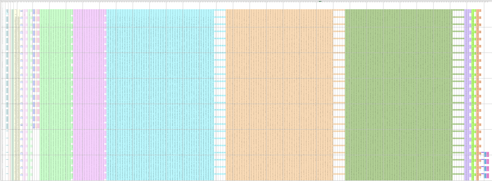
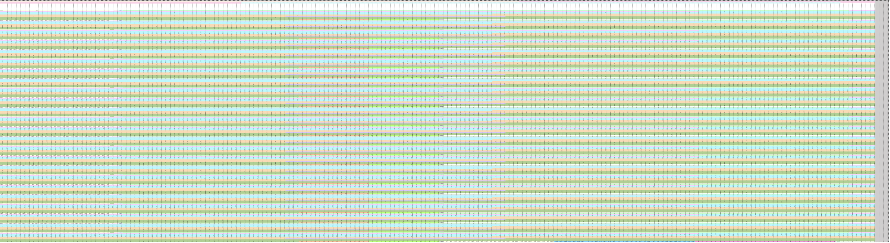

# Comparative Analysis of Two Keccak-256 Circuit Implementations

### 1. Introduction

Chiquito is a high-level structured language designed for the seamless implementation of zero-knowledge proof applications. It empowers developers to work with elevated and structured abstractions compared to most Zero-Knowledge Proof Domain-Specific Languages (ZKP DSLs), all without compromising performance. Currently, Chiquito boasts a fully integrated backend for Halo2.

As known, Halo2 stands as a formidable zero-knowledge proving system, evolving from Halo by transitioning its proof system to Plonk. This strategic shift eliminates the need to redo the trusted setup for each circuit structure. And It ensures scalability through custom gate and lookup table functionalities. Due to its compelling advantages, an increasing number of projects, including several zkEVM initiatives, have adopted Halo2 for circuit development.

However, despite Halo2's robust capabilities, it may not excel in every aspect as a general-purpose tool. For instance, it poses a significant challenge for newcomers to navigate its intricacies.

Chiquito serves as a complementary tool that addresses some of the challenges encountered in circuit development with Halo2. Firstly, Chiquito is notably user-friendly, making it accessible for developers at all levels. Beginners can easily grasp circuit writing concepts with Chiquito and appreciate the clarity it brings to the logic of the circuit.

Furthermore, Chiquito introduces features that aid in optimizing circuit size, enhancing the overall efficiency of the development process. An illustrative example of this is the implementation of a Keccak-256 circuit, where Chiquito-based implementation demonstrates notable advantages.

Notably, we have successfully implemented a version of the Keccak-256 circuit using Chiquito. Simultaneously, a version of the  Keccak-256 circuit exists in the zkEVM circuit repository from [Taiko](https://github.com/taikoxyz/zkevm-circuits). This document aims to leverage the  Keccak-256 circuit as a case study, providing a comprehensive analysis and comparison of the strengths and weaknesses inherent in building circuits with Chiquito versus the native Halo2 approach.

In our analysis of the circuit structure, we leverage a tool called [plaf](https://github.com/Dhole/polyexen) to facilitate the examination and comparison of the circuit's architecture.

### 2. What is Keccak?
In the initial section, we provide a concise overview of Keccak in this chapter, covering its definition, operational principles, and the constraints inherent in the Keccak circuit.
#### 2.1 Brief
Keccak stands as a versatile cryptographic function, widely recognized for its role as a hash function. Noteworthy among its features is the ability to process input data of any length and produce output data of any pre-set length. Its mechanism is grounded in a novel approach known as the sponge construction, utilizing a wide random function or random permutation. Derived from prior hash function designs PANAMA and RadioGatún, Keccak finds applications as a hash function, stream cipher, and more. It exhibits resistance against certain types of attacks, such as length extension attacks, while allowing greater flexibility in output length. Its innovative design, exceptional security, and adaptable output length position it as an ideal choice for various cryptographic applications in the rapidly evolving fields of digital currency and blockchain technology. As the cryptocurrency landscape continues to mature, the role of Keccak-256 in ensuring the security, integrity, and functionality of these systems may become increasingly crucial.

SHA-3, released by NIST in 2015, is the latest addition to the Secure Hash Algorithm family, essentially forming a subset of the broader Keccak cryptographic primitive family. Distinguishing itself from SHA-1 and SHA-2 in internal structure, SHA-3 boasts performance benefits. However, it is important to note that Keccak and SHA-3 are distinct entities, as NIST has adjusted the filling algorithm for SHA3, resulting in different outcomes. Sometimes, functions labeled as SHA-3 are actually implemented using Keccak-256, a specific member of the Keccak family that has gained significant attention, especially within various cryptocurrencies such as Ethereum.

Keccak-256 holds a prominent place in the Ethereum blockchain, finding application in multiple contexts. For instance, the Solidity programming language utilizes Keccak-256 for tasks like generating random numbers, compressing input data for signature creation, and deriving account addresses from public keys. In the past, Keccak-256 played a role in Ethereum's proof-of-work mining algorithm. Consequently, some zero-knowledge proof (zkp) projects necessitate verifying the Keccak-256 function within their circuits.

The Keccak-256 function is intricate, employing a specialized structure known as the sponge structure, comprising two phases: the absorbing phase and the squeezing phase. Both phases involve numerous bitwise operations and repetitive steps. As a one-way hash function, hash result verification requires recalculating the function with input values and comparing the output to the previously obtained hash. Given the advantage of custom gates and lookup tables in verifying bitwise operations, the Plonkish circuit exhibits significant strengths in verifying the Keccak Hash. This underscores the vast optimization potential and intricate skills involved in utilizing Halo2 for the verification of Keccak circuits, offering numerous best practices for exploration and discussion.

#### 2.2 Algorithm Details
Certainly, let's delve into the concrete implementation steps of the Keccak-256 algorithm. First, we'll introduce some key concepts, followed by a detailed description of the algorithm steps. Lastly, we'll outline the circuit design approach.
*Note: The specific data presented here is based on the current implementation of the circuit and does not represent the entirety of the Keccak algorithm's parameter settings. The parameters are specific to the analyzed circuit structure and may vary with different configurations of the some Keccak algorithm.*

##### 1. Pre-information
1. Sponge Structure: The Keccak-256 algorithm utilizes a sponge structure, consisting of two main phases: absorbing and squeezing. This structure allows for versatile and secure cryptographic operations.
2. $Keccak_f[b]$: The permutation function where b, the number of bits of the function's input and output, is 25, 50, 100, 200, 400, 800 or 1600 bits. Sponge construction is based on a wide random function or random permutation. It takes all the outputs of one round, permutes all bits. The width of the permutation is also the width of the state in the sponge construction. 
3. r: r is the bitrate.
4. c: c is the capacity, it defines the security level of the sponge. r + c =b.
5. multi-rate padding: The padding algorithm. It also called `pad10*1` pattern, wherein the first bit is set to 1, the last bit is also set to 1, and all intervening bits are set to 0.
6. data chunk: A data chunk represents a segmented portion of the padded input data, with each chunk measuring r bits.
7. Keccak-256: Parameters are set as follows: b=1600, r=1088, c=512.
8. State: The state is organized as an array of 5×5 lanes, each of length w, and b=25w.
##### 2. Algorithm
The approximate steps of the Keccak algorithm are as follows:
1. Input data of any length.
2. Pre-processing phase
    1. Perform multi-rate padding.
    2. Split the padded data.
3. Sponge structure processing phase.
    1. Absorbing phase.
    2. Squeezing phase.
4. Output data of a specific length.

###### Pre-processing phase
During this phase, our tasks involve padding and splitting the input data.

Firstly, the padding process aims to adjust the length of the input data to be a multiple of a specified chunk length. We achieve this by employing the `pad10*1` pattern.

Subsequently, the padded data undergoes the second task of splitting, where it is divided into multiple sets, with each set representing a data chunk. Each of these chunks, measuring 1088 bits in length, is then sequentially introduced into the sponge structure. This systematic feeding of individual chunks ensures a comprehensive processing of the entire padded data.

###### Absorbing phase
During this phase, 24 rounds of operations are performed. In each round, the input and output lengths are fixed, and data is fed in chunks. The state is often visualized as a grid of squares, where each square represents a single bit. The state is divided into the bitrate (r) and the capacity (c), with the bitrate length being the same as the chunk length.
1. **Initialization:**
    - Start with a fixed-length state, denoted as $S_0$.
2. **Permutation Round Execution:**
    - For each round, follow these steps:
        1. Padding: Pad the chunk value $X_i$ with c zeros, creating $X_i || 0^c$.
        2. XOR Operation: XOR the padded value with $S_i$, resulting in $S_i' = S_i \oplus (X_i || 0^c)$.
        3. Round Function: Perform 25 rounds, involving bit permutation operations in each round.
            - Convert the data from $S_i$ to a three-dimensional matrix, where w = 64 and $S_i[w * (5y+x) + z] = a [x] [y] [z]$.
            - Apply the following functions:
                1. Theta Function ($\theta$):
                    - Do xor operation for the same column values, then do xor operation with the x-1 and x+1 rows' xor operation.
                    - $\theta: a[x][y][z] = a[x][y][z] \oplus (a[x-1][0][z] \oplus a[x-1][1][z] \oplus a[x-1][2][z] \oplus a[x-1][3][z] \oplus a[x-1][4][z]) \oplus (a[x+1][0][z] \oplus a[x+1][1][z] \oplus a[x+1][2][z] \oplus a[x+1][3][z] \oplus a[x+1][4][z])$
                2. Rho Function ($\rho$):
                    - Shuffle the order of a vector at the same row and column.
                    - $a[x][y][z] = a[x][y][(z-(t+1)(t+2)/2) \mod 64]$, where $0 \leq t \lt 24$ and $\begin{pmatrix} 0 & 1 \\ 2 & 3 \end{pmatrix} ^t \begin{pmatrix} 0 \\ 1 \end{pmatrix} = \begin{pmatrix} x \\ y \end{pmatrix}$
                3. Pi Function ($\pi$):
                    - Permute all vectors $a[x'][y'] = a[x][y]$, where $\begin{pmatrix} x' \\ y' \end{pmatrix} = \begin{pmatrix} 0 & 1 \\ 2 & 3 \end{pmatrix}  \begin{pmatrix} x \\ y \end{pmatrix}$
                4. Chi Function ($\chi$):
                    - Shuffle values in a specific manner: $a[x] = a[x] + (a[x+1]+1)a[x+2]$
                5. Iota Function ($iota$):
                    - Shuffle values in the first row using round constants: $a = a \oplus RC[i]$, where RC is the round constants vector.
    -  Repeat the round function for 24 rounds in the entire permutation phase.

###### Squeezing phase
After the Absorbing phase, we start squeezing phase.
In summary, the steps are as follows:
1. **Initial Output**
    - Obtain the initial output Z_0 by extracting the first r-length values from S_24.
2. **Permutation Iteration**
    - If the length of Z_0 is less than the target length:
        - Apply the permutation function.
        - Extract the first r-length values in each iteration.
        - Append the extracted values to the output, creating Z_i.
        - Continue this process until the cumulative length satisfies the target length.
        This iterative approach ensures that the final output Z contains sufficient data to meet the desired target length.

#### 2.3 Keccak-256 circuit
Certainly, the Keccak-256 circuit is designed to verify whether a given hash message is the result of the Keccak-256 function applied to specific inputs. Here are some key considerations in the development of the circuit:
1. **One-Way Function Verification**
    - Hash functions, including Keccak-256, are one-way functions, emphasizing the irreversibility of the hashing process. Verification involves recalculating the hash with the same inputs and comparing the output with the provided hash message.
2. **Repetitive Steps and Circuit Components**
    - Many steps in the Keccak-256 algorithm are repetitive. To enhance efficiency, the circuit can be modularized into components, allowing for the repetition of key components. Different circuit code designs may lead to varying levels of efficiency.
3. **Bitwise Operations and Lookup Tables**
    - Bitwise operations, such as XOR, are prevalent in the circuit algorithm. While bitwise operations are not inherently circuit-friendly, the use of lookup tables significantly improves the efficiency of these bit operations. Optimizing the circuit for bitwise operations is crucial for performance.
4. **Plonkish Circuit and Custom Gates**
    - The intricate steps in the Keccak-256 algorithm align well with the capabilities of custom gates. Plonkish circuits, known for their compatibility with complex operations, have a distinct advantage in Keccak-256 verification. This suggests that there are numerous technical nuances and optimizations that can be employed to enhance the efficiency of the circuit.
    In summary, the development of the Keccak-256 circuit involves breaking down the algorithm into modular components, optimizing bitwise operations with lookup tables, and leveraging the strengths of custom gates, particularly in the context of Plonkish circuits. Efficient design choices and technical optimizations play a crucial role in ensuring the circuit's effectiveness and performance during the verification process.

Certainly, let's proceed with the analysis of two versions of the Keccak-256 circuit developed beyond Halo2. The first version is based on the direct implementation from the [taiko's zkEVM repository](https://github.com/taikoxyz/zkevm-circuits/tree/7f750aad7b10f0cd7f4eb8f593efaa0bf02e07ff/keccak256) using Halo2, and the second version is developed using the [DSL tool Chiquito](https://github.com/privacy-scaling-explorations/chiquito/pull/89).
### 3. Keccak-256 Circuit from Taiko's Repo (Halo2)
#### 3.1 The step of the Keccak-256 circuit
This chapter provides an analysis of the Keccak-256 circuit (hereinafter as Keccak) implementation from the [taiko's zkEVM circuit repository](https://github.com/taikoxyz/zkevm-circuits/tree/7f750aad7b10f0cd7f4eb8f593efaa0bf02e07ff/keccak256), specifically using the Halo2 library. The circuit size will be evaluated using the analysis tool [polyexen](https://github.com/Dhole/polyexen).
##### 1. Some tricky solutions
To enhance the efficiency of the Keccak circuit, some clever solutions have been implemented:
1. XOR Operation Optimization
	Utilizes addition (ADD) operations instead of XOR for arithmetic efficiency. The XOR of two values can be achieved by adding them together, with the result's last bit equivalent to the XOR result.
	Therefore, when we need to perform XOR operations on multiple bits, we can first add these bit values together and then take the last bit of the result as the XOR operation result.
2. Chi Operation Optimization
	Simplifies the Chi step by introducing a calculation: $r = 3 - 2 \cdot a[x] + a[x+1] - a[x+2]$. If the result is 1 or 2, it sets `a[x]` to 1; otherwise, it sets `a[x]` to 0.
3. Using three bits to represent one bit
	Due to the optimized computation steps employed during the calculation process, there are situations where multiple values need to be added. In all operations, the maximum is adding five values, and three bits are sufficient to represent it. Therefore, in practice, using three bits to represent one bit makes computation convenient.

##### 2. Execution Steps
The `multi_keccak` function is designed to verify multiple hashes, and its implementation involves several steps for efficient circuit development. Here's a more concise rephrasing of the key components and phases within the implementation:
Each Keccak instance within this function operates on a vector of u8, representing a byte array. The initial steps involve the assignment of rows with a length that is a power of 2. To facilitate this, a null vector's Keccak is introduced to pad the rows.

The implementation steps for the `multi_keccak` function are as follows:
1. **Input Handling**
    - Accepts several vectors of u8 (bytes) as input data.
2. **Row Assignment**
    - Assigns rows with a length that is a power of 2 for each vector, setting the row length to 12 for each permutation round.
3. **Padding**
    - Adds a null vector Keccak to pad the rows, ensuring uniformity in row lengths.
4. **Individual Processing**
    - Iterates through each vector.
    - Calls the `keccak` function for each vector, processing them one by one.
    This structured approach to input handling, row assignment, padding, and individual processing ensures a systematic and organized execution of the `multi_keccak` function.
##### 3. Keccak Processing
The implementation process for each Keccak instance involves several key steps:
1. **Input Processing:**
    - Converts the byte vector to a bit vector.
    - Pads the input to ensure consistent processing, it uses the `10*1` pattern to pad the bit vector. 
2. **Chunk Division:**
    - Divides the bit vector into several chunks, each with a length of 1088.
    - Makes the constraints for the relationship between the input byte array and bits array for each chunk. 
    - To reduce space waste, this phase does not allocate separate space to fill this part of the data. Instead, it distributes the space for this part among the 24 rounds of permutation and the squeezing round to minimize resource waste.
3. **State Matrix Initialization (s)**
    - Utilizes a two-dimensional vector `s` as a 5 * 5 matrix. 
    - Each value in the matrix consists of 64 bits, with each bit extended to 3 bits.  
    - This design proves advantageous for subsequent permutation functions.
    - It also distributes the space for this part among the 24 rounds of permutation and the squeezing round to minimize resource waste.  
    - It sets three columns in the cells, one column for 8 byte values, another for the bit array of these 8 byte values, and a third column to check whether the input value is the original input value or a padding value.
4. **XOR Operation for Input Chunks** 
    - Performs XOR for the state matrix `s` with each chunk.
    - Executes XOR calculations for each chunk.
    - Results are used in the subsequent permutation function.
    - Put these 25 initial values, input values, and the results of XOR operations into cells, and establish constraint relationships.
    - Splits the XOR result value, as well as the sum of the initial value and the input value, into 64 values and performs XOR operations one by one. To improve efficiency, it utilizes only 16 cells to represent one value.
    - It sets two columns in the cell to constraint the input (absorb) and two columns to constrain whether the values are padded or not.
5. **Permutation Phase (5 Steps)**
    - Utilizes a CellManager to manage 12 rows for each permutation round.
    - Theta Phase (3 Steps):
	    1. It calculates or checks each row in the `s` array for the XOR operations, then utilizes a lookup table to obtain the XOR result.
	    2. In order to enhance efficiency, it employs only 32 cells to represent one value. In total, $32 \times 5 \times 2 = 320$ cells are used.
	    3. Then, it calculates or checks the new values of the `s` array for the XOR operations, using a lookup table to obtain the XOR result.
	    4. To improve efficiency, it utilizes only 22 cells to represent one value. In total, $22 \times 25 \times 2 = 1100$ cells are used.
    - Rho Phase:
        - Shuffles the order of a vector in the same row and column. Here, there is no need to create new cells to constrain this relationship. But since multiple bits are combined in one cell here, an additional 26 cells are needed to separate the data during the bit shifting check.
    - Pi Phase:
        - Changes the order of 25 cells. Here, there is no need to create new cells to constrain this relationship too.
    - Chi Phase:
        - Shuffles values using a specific XOR operation.
        - Uses a lookup table to optimize the process too.
        - To improve efficiency, it utilizes only 22 cells to represent one value. In total, $22 \times 25 = 550$ cells are used.
    - Iota Phase:
        - Performs XOR operations for a specific state matrix element.
        - Uses a lookup table to optimize the process too.
        - To improve efficiency, it utilizes only 16 cells to represent one value. In total, $16 \times 2 = 32$ cells are used.
6.  **RLC**
	- RLC is used to quickly check the correctness of input and output values. It utilizes an accumulator to cumulatively add the inputs (or outputs).
	- Using 256 as randomness is akin to arranging all the values in direct sequential order.
1. **The squeezing phase**
	*  Following the completion of 24 rounds of permutation operations, the algorithm proceeds to the squeezing phase. In this phase, only an output of a fixed length of 32 bytes is required, so there is no need for a new permutation round. 
	- Conversely, it needs to convert the output bit vector to a byte vector. Similarly, it is necessary to constrain the relationship between the two. Since the output is 32 bytes, it is only necessary to read the values at four 's' positions.
	- The squeezing phase efficiently utilizes the existing state and concludes the circuit. 
#### 3.2 Keccak circuit data analysis
We have analyzed the circuit based on the following key points:
1. **Number of Rows in the Circuits:** Each permutation utilizes 12 rows. For a complete permutation function, i.e., one chunk's operation, it requires 25 * 12 rows.
2. **Number of Columns in the Circuits, Including Witnesses and Fix columns:** The circuit employs 202 witness columns and 18 fixed columns.
3. **Number and Size of Lookup Tables:** The circuit utilizes 5 tables, namely normalize_3, normalize_4, normalize_6, chi_base_table, and pack_table. These tables are queried 123 distinct times in total.
4. **Utilization Ratio of Witness Row's Cells:** It exceeds 89.2%.
5. **Number of Constraints:** There are 164 non-repetitive constraints.

### 4. Keccak-256 Circuit Beyond Halo2 using Chiquito
The chapter will describe the Keccak circuit implementation from Chiquito example, and analysis the circuit size by the analysis tool  [polyexen](https://github.com/Dhole/polyexen) too.
#### 4.1 The step of the Keccak circuit
##### 1. Chiquito's feature
In Chiquito, several features contribute to the advantages in circuit development and optimization:

1. **Step Concept**
   
    - The concept of "Step" is introduced through the `step_type_def` function.
    - This function adds constraints to a step type and defines witness generation.
    - Repeated calls to the same `step_type_def` function enable the definition of a single round for the permutation function, which can be reused multiple times.
2. **Selector Optimization**
   - [An important optimization](https://github.com/privacy-scaling-explorations/chiquito/blob/main/src/plonkish/compiler/step_selector.rs#L192-L247) in the selector is that the number of selectors becomes O(log n).
    - When it requires a large number of selectors, Chiquito employs a optimization to reduce the number of selectors to O(log n).
3. **Row Size Collapse**
   
    - By default, each step is placed in a single row, resulting in potentially long rows.
    - Chiquito provides a [method](https://github.com/privacy-scaling-explorations/chiquito/blob/802615f734eb8cbf2e11c7a3716bc017e92488fa/src/plonkish/compiler/cell_manager.rs#L233-L366) to split a row into multiple rows, allowing for flexibility in defining the size of a row.
4. **Cell Number Optimization**
   
    - Each step initially takes over one row, leading to equal the number of cells for all steps, even with some cells being unused.
    - To minimize the number of unused cells, attention is given to optimizing the size of all steps.
5. **Different Steps and Signal Types**
   - Chiquito divides all witness columns into two types: forward signal and internal signal.
    - Forward signals can be passed between different steps, while internal signals are used within a step.
    - This differentiation provides a convenient way to constrain the relationships between values in different steps.
    - Due to the constraint structure, it is quite difficult to write some constraints where same columns for different functions. The internal signal provides the convenient way. It encapsulates the implementation of the algorithm so that users do not have to worry about the specific writing of constraints. Users can directly define different constraint relationships on the same column at different steps, which to some extent reduces the waste of cell space.
##### 2. Keccak Processing
  Different from the zkEVM version, there is no multi-verification version in this implementation as combined calculations are not optimized for the circuits themselves. 

  Similar to the previous version,  the process involves splitting the bit vector into several chunks, each with a length of 1088(1088 = 17 * 8 * 8). Each chunk uses a two-dimensional vector `s` to hold values in a 5 * 5 matrix. Each value in this matrix consists of 64 bits, extended to 3 bits for advantageous design in the subsequent permutation function.

  The Steps is split into two components: the first is the XOR operation for the input chunk, and the second is the 25 rounds of the permutation function.
1. **XOR Operation for Input Chunk**
	  - 17 XOR calculations are performed for the input chunk.
	  - Makes the constraints for the relationship between the input byte array and bits array for each chunk. 
2. **Permutation Phase**
	  - A step named `keccak_one_round` is defined to check one round of the permutation function. 
	  - Due to the features of Chiquito, this step achieve similar outcomes to the permutation steps in the taiko version but with some differences.
	  - XOR and Chi operations continue to require the splitting of one value into 64 values.  To improve efficiency, it utilizes less cells to represent one value too.
	  - Due to the fact that each round of permutation is implemented in a single step here, with its constraints distributed along the same row, it effectively reduces a significant amount of idle circuit units.
3.  **The squeezing phase**
	1. It only needs 90 cells for the squeezing phase.
	2. In order to reduce the circuit. It allocate cells in the last permutation phase, rather than allocate several new rows for the squeezing phase.
#### 4.2 Keccak circuit data analysis

We have analyzed the circuit based on the following key points:

1. **Number of Rows in the Circuits:** Initially, each step occupies only one row. For each chunk, which involves processing steps and 24 rounds of permutation, the folded version occupies approximately 11 rows when assuming a custom column width of 202 including 3 columns for step selectors(In order to get the same column number with taiko's version) .
2. **Number of Columns in the Circuits, Including Witnesses and Fix columns:** Chiquito offers the flexibility to customize the witness column width. There are 21 fix columns.
3. **Number and Size of Lookup Tables:** Six lookup tables are employed respectively, 5 tables are similar to the previous version, and another is used to set round constant parameters. In total, there are 181 non-repetitive lookup queries.
4. **Utilization Ratio of Cells:** In the pre-step, 181 cells are utilized, while each permutation step requires 2091 cells. Overall, for one chunk, it utilizes approximately 94.1 % of the available cells.
5. **Number of Constraints:** There are nearly 240 distinct constraints in total.

### 5. Compare the difference

In this chapter, we compare two versions of the Keccak circuit implementation. 
Next, we will compare the two versions at various points.

| No. | compare | Taiko | Chiquito | comment |
|-----|---------|-------|----------|-----------|
|1 | signal/multi keccak|multi | single| Simultaneously processing multiple inputs doesn't bring significant circuit optimizations for each vector of inputs.|
|2 |Squeezing phase| YES | NO | The step in Chiquito allows us to place the final squeeze step in the previous step.|
|3 |Different proof systems| NO | YES | Chiquito allows support for different backends in proof systems. This flexibility enables users to choose and integrate various proof systems according to their requirements or preferences. |
|4 |Selector Optimization | NO | YES | Chiquito employs a optimization to reduce the number of selectors to O(log n)|
|5 |Customize the Row Width | No | YES|Chiquito provides a method, allowing for flexibility in defining the width of a row.|
|6 |Customize the Row Number | YES | NO |The number of rows occupied by each round in Chiquito is determined based on the line width after row folding. Taiko version supports tuning the number of rows per round.|
|7 |Lines of code | 2246 | 1764 |-|

The following table provides a comparison of the numbers of key parameters between the two versions of circuit implementations using the input value [0, 1, 2, 3, 4, 5, 6, 7] as an example.

| No. | key parameter | number of taiko version | number of Chiquito version|
|----|-----------------|--------------------|---------------------|
| 1 | Rows | 311 | 275 |
| 2 | Fixed column | 19 | 21 |
| 3 | Witness column | 202 | 202 |
| 4 | the total number of cells in the witness column | 60600 | 555000|
| 5 | Utilization Ratio of Assigned Witness Cells | 83.2% | 91.6% |
| 6| Lookup Tables | 5 | 6 |
| 7 | Expression Number | 2621 | 715 |
| 8 | Maximum expression degree in gates | 3 | 7 |
| 9 | Maximum expression degree in Lookups | 1 | 5 |
| 10 | Number of Rotations Used(advice) | 2272 | 2129 |
| 11 | Number of Rotations Used(instance) | 0 | 0 |
| 12 | Number of Rotations Used(fixed) | 30 | 15 |

Due to differences in design details, there is a variation in the expression degree between the Chiquito version and the Taiko version. The Chiquito version has a higher expression degree primarily because it incorporates a selector optimization feature. In the examples, we require three fixed columns('q_enable', 'q_first', 'q_last') of advice as selectors. Additionally, there are three fundamental columns that need to be used for one or two columns in each expression. As a result, the Chiquito version requires the use of 3 to 4 additional columns. Moreover, the expressions in Lookups also necessitate 4 more columns (one for the 'q_enable' column and three for the three columns of advice used as selectors) in certain expressions.

For Chiquito version, "Rotations" is utilized across a total of 202 columns of Advice, with each column undergoing rotations ranging from 9 to 12 times, with values ranging between 0 and 11.

The Taiko version is a bit more complex. Here is a data summary regarding the utilization of Rotations about advice columns. The first columns is the index of advice columns, and the second columns is about the rotations used at these columns.

| Advice Columns | Rotation |
| :------------- | -------- |
|0 | 0, -12|
|3 | 0|
|2 | -12, 0|
|1 | -12, 0, 1, 2, 3, 4, 5, 6, 7, 8|
|199 | -48, -24, -36, -12, 0|
|201 | -48, 0, 1, 2, 3, 4, 5, 6, 7, -12, -11, -10, -9, -8, -7, -6, -5, -24, -23, -22, -21, -20, -19, -18, -17, -36, -35, -34, -33, -32, -31, -30, -29, -47, -46, -45, -44, -43, -42, -41|
|87, 88, 89, 90, 91, 137, 138, 139, 140, 141, 187, 188, 189, 190, 191 | 0, 1|
|8, 10, 196 | 0, 1, 2, 3|
|6 | 0, 1, 2, 3, 12, 13, 14, 15, 25, 26, 27, 37, 38, 39, 49, 50, 51, 61, 62, 63, 73, 74, 75, 85, 86, 87, 97, 98, 99, 109, 110, 111, 121, 122, 123, 133, 134, 135, 145, 146, 147, 157, 158, 159, 169, 170, 171, 181, 182, 183, 193, 194, 195, 205, 206, 207|
|194 | 0, 1, 2, 3, 4, 5|
|11, 12, 200 | 0, 1, 2, 3, 4, 5, 6, 7|
|13 | 0, 1, 2, 3, 4, 5, 6, 7, -89, -5|
|27 | 0, 1, 2, 3, 4, 5, 6, 7, 8|
|185 | 0, 1, 2, 3, 4, 5, 6, 7, 8, 10, 9, 11|
|7, 9, 14, 15, 16, 17, 18, 19, 20, 21, 22, 23, 24, 25, 26, 32, 36, 37, 38, 43, 45, 46, 49, 54, 57, 58, 60, 65, 69, 70, 71, 82, 83, 84, 92, 93, 94, 98, 103, 105, 106, 109, 114, 117, 118, 120, 125, 129, 130, 132, 142, 147, 152, 153, 154, 158, 163, 165, 166, 169, 174, 177, 178, 180, 192, 193, 195, 197 | 0, 1, 2, 3, 4, 5, 6, 7, 8, 9, 10, 11|
|4, 5 | 0, 1, 2, 3, 4, 5, 6, 7, 8, 9, 10, 11, 12, 13, 14, 15, 16, 17, 18, 19, 20, 21, 22, 23|
|76 | 0, 1, 2, 3, 4, 5, 6, 7, 9, 11, 8, 10|
|131 | 0, 1, 2, 4, 6, 8, 10, 3, 5, 7, 9, 11|
|186 | 0, 1, 3, 5, 2, 4, 6, 7, 8, 9, 10, 11|
|34, 55, 67, 81, 115, 127, 151, 175 | 0, 10, 11, 1, 2, 3, 4, 5, 6, 7, 8, 9|
|35, 44, 56, 68, 104, 116, 128, 164, 176 | 0, 11, 1, 2, 3, 4, 5, 6, 7, 8, 9, 10|
|47, 59, 85, 95, 107, 119, 133, 143, 155, 167, 179 | 0, 2, 3, 4, 5, 6, 7, 8, 9, 10, 11, 1|
|77 | 0, 2, 4, 1, 3, 5, 6, 7, 8, 9, 10, 11|
|198 | 0, 3, 2, 1|
|39, 48, 72, 86, 96, 108, 134, 144, 156, 168 | 0, 3, 4, 5, 6, 7, 8, 9, 10, 11, 1, 2|
|28, 40, 61, 73, 97, 121, 135, 145, 157, 181 | 0, 4, 5, 6, 7, 8, 9, 10, 11, 1, 2, 3|
|41 | 0, 5, 6, 7, 8, 1, 2, 3, 4|
|29, 50, 62, 74, 110, 122, 136, 146, 170, 182 | 0, 5, 6, 7, 8, 9, 10, 11, 1, 2, 3, 4|
|30, 51, 63, 75, 99, 111, 123, 159, 171, 183 | 0, 6, 7, 8, 9, 10, 11, 1, 2, 3, 4, 5|
|31, 52, 64, 78, 100, 112, 124, 148, 160, 172, 184 | 0, 7, 8, 9, 10, 11, 1, 2, 3, 4, 5, 6|
|53, 79, 101, 113, 149, 161, 173 | 0, 8, 9, 10, 11, 1, 2, 3, 4, 5, 6, 7|
|33, 42, 66, 80, 102, 126, 150, 162 | 0, 9, 10, 11, 1, 2, 3, 4, 5, 6, 7, 8 |

Here is a data summary regarding the utilization of Rotations about fixed columns. 

| Code Version | Fixed Columns                                          | Rotation                                        |
| ------------ | ------------------------------------------------------ | ----------------------------------------------- |
| Taiko        | 0                                                      | 0, -1, -2, -3, -4, -5, -6, -7, -8, -9, -10, -11 |
|              | 1                                                      | 0, -12                                          |
|              | 2, 3, 4, 5, 6, 7, 8, 9, 10, 11, 12, 13, 14, 15, 16, 17 | 0                                               |
| Chiquito     | 0, 1, 3, 4, 6, 7, 9, 10, 12, 13, 15, 16, 18, 19, 20    | 0                                               |

The difference in the "Rotations" presentation between the Chiquito and Taiko versions can be attributed to their respective approaches. In the Chiquito version, all witnesses within the same step are flattened into a single row, which is then divided into multiple rows. On the other hand, Taiko pre-allocates the determined rows for each step and sequentially arranges witnesses in columns, resulting in a somewhat cluttered appearance. Additionally, in the Taiko version, some initial and final steps are distributed across various smaller steps for optimization purposes, which leads to larger spans of Rotations.

The following image provides an overview of the cell usage in two versions of the witness, where the same color indicates cells with the same function, and colorless cells represent those that are unused.

[Overview of taiko version]

[Overview of Chiquito version]
From the diagrams, it is evident that both versions occupy multiple consecutive rows in each round of computation, but the arrangement differs. This is due to Chiquito initially allocating all cells within a step to one row, before folding them. However, compared to the other version, Chiquito's version has fewer idle cells and a higher utilization rate of cells. 

### 6. Conclusion
In conclusion, it is evident that developing circuits directly on halo2 is more native and straightforward. On the other hand, Chiquito, as an additional DSL layer, can theoretically implement all optimization strategies present in native circuits and offers code with enhanced readability. Moreover, Chiquito provides a simpler development interface and incorporates features such as selector optimization, row size collapse, and more. These inherent features in Chiquito significantly contribute to reducing development complexity.

### References

* https://github.com/privacy-scaling-explorations/chiquito/pull/89
* https://github.com/taikoxyz/zkevm-circuits
* https://wiki.rugdoc.io/docs/introduction-to-ethereums-keccak-256-algorithm/
* https://www.linkedin.com/pulse/understanding-keccak256-cryptographic-hash-function-soares-m-sc-/
* https://keccak.team/keccak.html
* https://zhuanlan.zhihu.com/p/624827562
* https://github.com/Dhole/polyexen
* https://en.wikipedia.org/wiki/SHA-3
